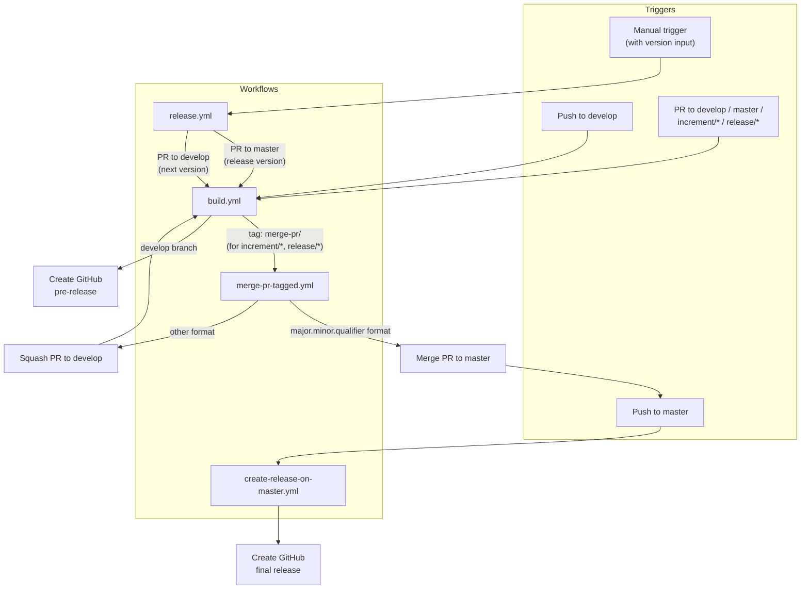

# Development Version and Branch Handling

This document describes the branching strategy, version numbering conventions, and CI/CD pipeline for this project.

## Branches

The versioning policy is based on [GitFlow](https://www.atlassian.com/git/tutorials/comparing-workflows/gitflow-workflow).

| Branch | Purpose |
|--------|---------|
| `develop` | Main development branch containing the latest sources of the active version |
| `feature/JNG-xxx_short_summary` | Feature branches based on `develop` for new features |
| `(release/)X.Y.Z` | Release branches (the `release/` prefix is reserved for CI) |
| `bugfix/JNG-xxx_short_summary` | Bug fixes based on release branches; must also be applied to newer release and development branches |
| `support/JNG-xxx_short_summary` | Support branches for previous releases; same merge-forward rules as bugfix |
| `hotfix/JNG-xxx_short_summary` | Hot fixes applied to both release and master branches |
| `master` | Latest released sources of the active version |

### Branch Flow

```mermaid
gitGraph
    commit id: "init"
    branch develop
    checkout develop
    commit id: "dev-1"
    branch feature/JNG-1
    commit id: "feat-1a"
    commit id: "feat-1b"
    checkout develop
    merge feature/JNG-1 id: "merge-feat-1"
    branch feature/JNG-3
    commit id: "feat-3"
    checkout develop
    merge feature/JNG-3 id: "merge-feat-3"
    branch release/1.0-beta1
    commit id: "rc-1"
    branch bugfix/JNG-4
    commit id: "fix-4"
    checkout release/1.0-beta1
    merge bugfix/JNG-4 id: "merge-fix"
    checkout develop
    merge release/1.0-beta1 id: "release-to-dev"
    checkout master
    merge release/1.0-beta1 id: "release-to-master"
```

## Version Numbers

Version numbers follow semantic versioning with these rules:

| Event | Version Change |
|-------|---------------|
| Starting a `feature/` branch | No version change |
| Starting a release branch from `develop` | 2nd number on `develop` is incremented |
| Creating a `bugfix/` branch | No version change — fixes applied on release branches before merge to master |
| Starting a `support/` branch | 3rd number is incremented — used for minor changes to a previous release |
| Starting a `hotfix/` branch | 4th number is incremented — applied to both release and master |

## GitHub Actions Workflows

The CI/CD pipeline consists of several interconnected workflows:

### Workflow Interaction



### build.yml

Triggers on pushes to `develop` and pull requests to `develop`, `master`, `increment/*`, and `release/*`.

**Steps:**
1. Determines the version:
   - For `master` / `release/*`: uses the POM version without `-SNAPSHOT`
   - For `develop` / `increment/*`: generates `major.minor.qualifier.date_commitId_branchName`
2. Builds and deploys artifacts to Nexus
3. Creates a git tag `v<version>`
4. For `increment/*` and `release/*`: creates a `merge-pr/<version>` tag (triggers `merge-pr-tagged.yml`)
5. For `develop`: builds a changelog and creates a GitHub pre-release

### merge-pr-tagged.yml

Triggers on `merge-pr/*` tags.

**Steps:**
1. Extracts `<version>` from the tag name
2. If the version is in `major.minor.qualifier` format: merges the PR to `master` (triggers `create-release-on-master.yml`)
3. Otherwise: squashes the PR to `develop` (triggers `build.yml`)
4. Deletes the `merge-pr/<version>` tag

### create-release-on-master.yml

Triggers on pushes to `master`. Builds a changelog and creates a final GitHub release.

### release.yml

Manually triggered with a version input (either `auto` or a specific `major.minor.qualifier`).

**Steps:**
1. Determines the release version (from POM if `auto`, or from input)
2. Calculates the next development version (qualifier + 1)
3. Creates a PR to `master` with the release version
4. Creates a PR to `develop` with the next version

## How to Develop

> **Important:** There is no commit without a ticket number. All commits and pull requests must include a JIRA reference in `JNG-xxx` format.

Issue tracking: [JIRA Dashboard](https://blackbelt.atlassian.net/jira/dashboards)
