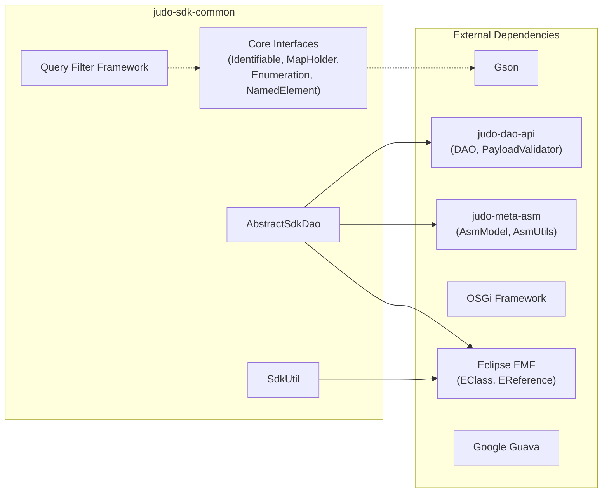

# judo-sdk-common

[](https://github.com/BlackBeltTechnology/judo-sdk-common/actions/workflows/build.yml)

## Introduction

This repository provides the base classes and interfaces that **generated JUDO SDK source code** depends on at runtime. It is a foundational library in the JUDO ecosystem — generated DAOs, transfer objects, and query builders all extend or implement types defined here.

The library is packaged as an **OSGi bundle** and uses **Eclipse EMF** for model representation, bridging the generated SDK layer with the underlying DAO and metamodel infrastructure.

## What This Module Provides

| Area | Key Types | Purpose |
|------|-----------|---------|
| **Entity identity** | `Identifiable`, `NamedElement` | Standard interfaces for entity identification, versioning, and type introspection |
| **Data conversion** | `MapHolder`, `SdkUtil` | Convert SDK entities to/from `Map<String, Object>` payloads consumed by the DAO layer |
| **DAO base** | `AbstractSdkDao` | Abstract superclass for all generated SDK DAOs — wires `DAO`, `AsmModel`, and `PayloadValidator` |
| **Query filters** | `Filter`, `Operation`, type-specific filters | Type-safe filter builder framework for constructing JQL-like query predicates |
| **Enumerations** | `Enumeration` | Interface for generated enum types with ordinal/name/FQN mapping |

## Architecture Overview

```mermaid
classDiagram
    class Identifiable {
        <<interface>>
        +getIdentifier() Serializable
        +getEntityType() String
        +getVersion() Integer
        +adaptTo(Class~T~) T
    }

    class MapHolder {
        <<interface>>
        +toMap() Map~String, Object~
        +adaptTo(Class~T~) T
    }

    class AbstractSdkDao {
        <<abstract>>
        #dao: DAO
        #asmModel: AsmModel
        #asmUtils: AsmUtils
        #payloadValidator: PayloadValidator
        +setDao(DAO)
        +setAsmModel(AsmModel)
        #getEClass(String) EClass
    }

    class SdkUtil {
        +asMap(Collection~T~)$ Collection~Map~
        +asMap(T)$ Map~String, Object~
        +getReference(EClass, String)$ EReference
    }

    class Filter {
        <<interface>>
        +getOperation() Operation
        +getValueAsString() String
        +toString(String) String
    }

    class Operation {
        <<interface>>
        +getPattern() String
    }

    class StringFilter
    class NumberFilter
    class BooleanFilter
    class DateFilter
    class TimeFilter
    class TimestampFilter
    class EnumerationFilter

    Filter --> Operation : uses
    StringFilter ..|> Filter
    NumberFilter ..|> Filter
    BooleanFilter ..|> Filter
    DateFilter ..|> Filter
    TimeFilter ..|> Filter
    TimestampFilter ..|> Filter
    EnumerationFilter ..|> Filter

    SdkUtil --> MapHolder : calls toMap()
    AbstractSdkDao --> "DAO (judo-dao-api)" : delegates
    AbstractSdkDao --> "AsmModel (judo-meta-asm)" : resolves types
```

## Dependency Graph



## Context

This project is a building block of the [judo-community](https://github.com/BlackBeltTechnology/judo-community) aggregator project. To understand how this module fits into the broader ecosystem, see the corresponding documentation there.

## Build Commands

```bash
# Run tests
mvn clean test

# Full build and install
mvn clean install
```

## Contributing

Everyone is welcome to contribute to JUDO! See the [Contributing Guide](CONTRIBUTING.md) for details.

## License

This project is licensed under the [Eclipse Public License - v 2.0](https://www.eclipse.org/legal/epl-2.0/).
